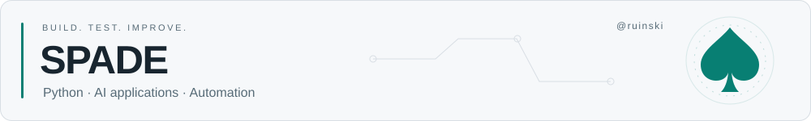

<picture>
  <source media="(prefers-color-scheme: dark)" srcset="assets/profile-header-dark.svg" />
  <source media="(prefers-color-scheme: light)" srcset="assets/profile-header-light.svg" />
  
</picture>

<strong>데이터를 읽고 · 모델을 연결하고 · 반복을 줄입니다.</strong>

Python으로 데이터를 다루고, AI 기능을 실제로 사용할 수 있는 도구로 연결합니다.

### 🧰 Tech stack

  
  
  
  

### 🔎 What I build

| 📄 Document AI | 🧠 AI Services | ⚙️ Automation |
| :--- | :--- | :--- |
| **이미지를 데이터로** | **모델을 서비스로** | **반복 작업을 흐름으로** |
| 문서 보정 · OCR · 데이터 추출 | 입력 처리 · 모델 추론 · API | 요청 · 생성 · 검토 · 결과 저장 |

### 🗂 Open repositories

[**torch_Test**](https://github.com/ruinski/torch_Test) &nbsp; · &nbsp; Python

[공개 저장소 둘러보기 →](https://github.com/ruinski?tab=repositories)

---

♠ &nbsp; 작게 만들고, 직접 확인하고, 계속 개선합니다.

